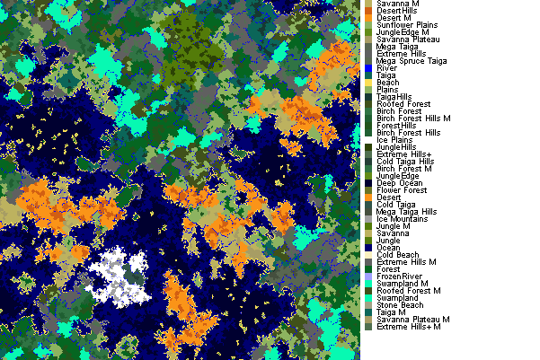

# BiomeAtlas

A Forge mod for 1.7.10 that generates a map of biomes via command or on startup.

* Supports mod-added biomes.
* Great for finding that perfect seed.



## Compiling

    ./gradlew clean build

## Usage

    /biomeatlas <apothem>
    
Apothem is the "radius" of a square around you in chunks (not blocks). Each chunk is a 16x16 area of blocks.

### Generate on Start

Or instead, you can have map generation be initiated when a server is started with:

	-DbiomeAtlas.mapOnStartup=true

Such as:

	java -Xmx5G -DbiomeAtlas.mapOnStartup=true -jar forge.jar

You can also define the following properties:

	-DbiomeAtlas.apothem=250
	-DbiomeAtlas.mapDimension=0
	-DbiomeAtlas.centerX=0
	-DbiomeAtlas.centerZ=0
	-DbiomeAtlas.exitOnFinish=false

### Finding a Seed

To find an ideal seed, you can make a Batch script or a shell script to continually restart a server with a new seed and have BiomeAtlas generate a map each time.

Linux:

```sh
for i in `seq 1 50`;
do
	rm -Rf world
	java -Xmx5G -DbiomeAtlas.mapOnStartup=true -DbiomeAtlas.exitOnFinish=false -jar forge.jar
done
```

Windows:

```batch
@echo off
for /l %%x in (1, 1, 50) do (
   rmdir /s /q world
   java -Xmx5G -DbiomeAtlas.mapOnStartup=true -DbiomeAtlas.exitOnFinish=false -jar forge.jar
)
pause
```

You should find a bunch of **biomeatlas_<seed>.png** files in the same directory.

## License

MIT License.
